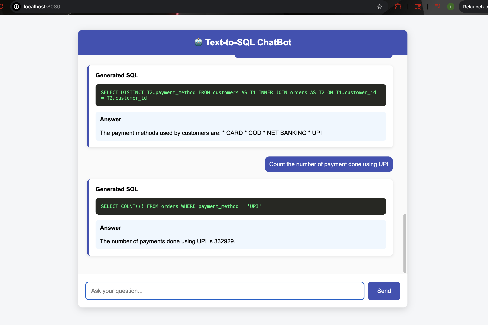

# Text-To-Sql with FastAPI
A FastAPI-based project that enables text-to-sql functionality.


## Features

* Text-to-SQL functionality using LLM (Large Language Model) technology
* FastAPI-based API for efficient querying
* Dockerization for easy deployment


### Install dependencies: 

```bash
pip install -r requirements.txt
```
### Build and start the container: 
```bash
docker-compose up
```
### Backend Server 
Server will start(if you wanted to verify by pasting the below URL to anyBrowser)

```bash
http://localhost:8000/docs
```
### Frontend Server

```bash
http://localhost:8080/
```


### API Endpoints
* /api/v1/chat: Input natural language query to receive SQL response
* Send a POST request to /chat with JSON body containing the text query.
Receive the corresponding SQL response.


```json
curl --location 'http://127.0.0.1:8000/api/v1/chat' \
--header 'accept: application/json' \
--header 'Content-Type: application/json' \
--data '{
  "question": "find the customer with the most orders"
}'
```
